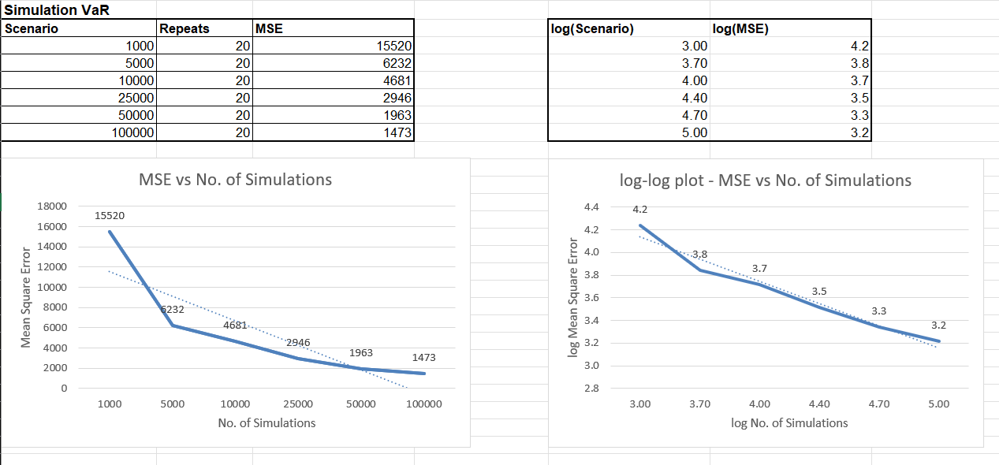
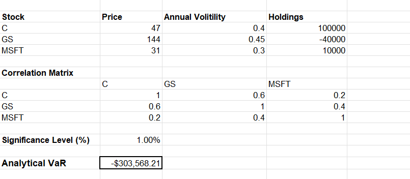

# Monte Carlo VaR Estimator

This repository contains a VBA Excel project for calculating the Value at Risk (VaR) of a financial portfolio using both analytical and numerical methods, including Cholesky decomposition and Monte Carlo simulation. It is designed to provide a comprehensive toolset for financial risk management within Excel.

<div style="display: flex; justify-content: space-between;">
  
</div>

## Features

- **Analytical Methods**: Utilizes standard formulas for VaR calculation.
- **Numerical Methods**: Employs Cholesky decomposition to handle correlated asset returns.
- **Monte Carlo Simulation**: Simulates numerous scenarios to estimate VaR accurately.

<div style="display: flex; justify-content: space-between;">
  
</div>

## Files

- `Demo.xls`: Example Excel file demonstrating the usage of the VaR estimator.
- `VaR_Estimator.vba`: VBA script for performing VaR calculations.
- `README.md`: Documentation file.

## Installation

1. Clone the repository:

    ```bash
    git clone https://github.com/adibakshi28/MonteCarlo_VaR_Estimator.git
    ```

2. Open `Demo.xls` in Excel.
3. Ensure macros are enabled to use the VBA script.

## Usage

1. **Input Data**: Populate the Excel sheet with your portfolio data. The expected data includes asset returns and their correlations.
2. **Run VBA Script**: Execute the `VaR_Estimator.vba` script to perform VaR calculations. This can be done by running the macro in Excel.
3. **View Results**: The results of the VaR calculations, including both analytical and simulation-based VaR values, will be displayed in the Excel sheet.

## Analytical VaR Calculation

- **Formula-Based Approach**: Uses the standard deviation and mean of portfolio returns to estimate VaR.
- **Confidence Intervals**: Allows for customization of confidence intervals to suit different risk appetites.

## Numerical VaR Calculation

- **Cholesky Decomposition**: Used to decompose the covariance matrix of asset returns, allowing for correlated random variables in simulations.
- **Monte Carlo Simulation**: Generates a large number of random portfolio return scenarios to estimate VaR. This method captures non-linear risks and tail risks more effectively than analytical methods.

## Contributing

1. Fork the repository.
2. Create a new branch (`git checkout -b feature-branch`).
3. Commit your changes (`git commit -am 'Add new feature'`).
4. Push to the branch (`git push origin feature-branch`).
5. Create a new Pull Request.

## License

This project is licensed under the MIT License. See the LICENSE file for details.

## Contact

For any inquiries or support and issues, please contact Adibakshi.
